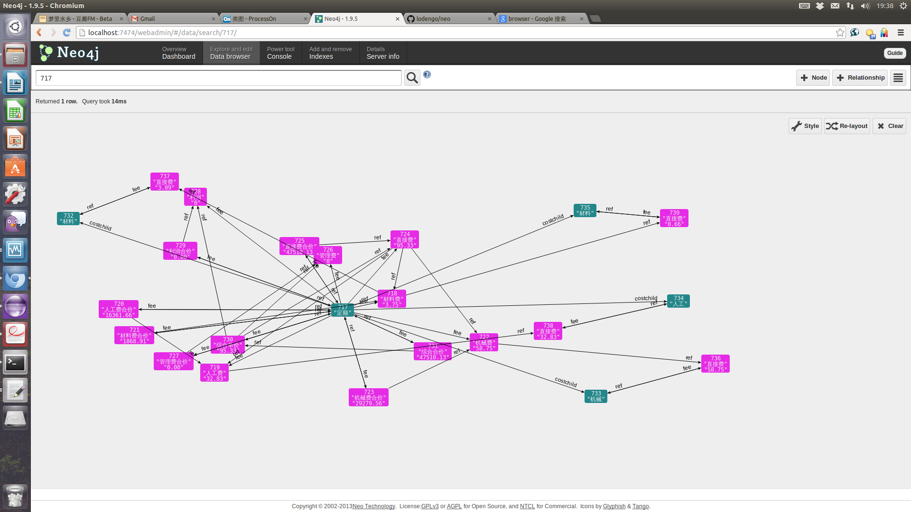

neo
===
1. install node.js, see http://nodejs.org/
2. install neo4j, see http://www.neo4j.org/
3. $ git clone https://github.com/lodengo/neo.git
4. $ npm install
5. $ node app
6. open in browser: http://localhost:7474/webadmin/#/data/search/start%20n%3Dnode(*)%20return%20n/

